# Beyond Injection Detection: A Positive-Security Prompt Firewall that Closes the Scope and PHI Gap SOTA Classifiers Miss in Healthcare

**QFIRE — a parallel, low-latency Rust firewall benchmarked against PromptGuard-2 and DeBERTa-v3**

*Task Force for AI Agents in Healthcare — 2026-05-30*

> This is the readable Markdown rendering of the paper. The arXiv-ready LaTeX
> source is `paper/main.tex` (+ `paper/refs.bib`); all result tables are
> generated from the benchmark JSON by `scripts/make_tables.py` and embedded
> below verbatim from the measured runs (seed 42, local Ollama, no paid keys).

## Abstract

LLMs embedded in agents process trusted instructions and untrusted data in one
context window, leaving them open to direct and indirect prompt injection.
Existing runtime guardrails trade safety against latency: model-based auditors
are accurate but add hundreds of milliseconds of Python inference, while lexical
filters are fast but blind to obfuscated or semantically disguised payloads. We
present **QFIRE**, an inline, provider-agnostic prompt firewall implemented as a
single self-contained Rust toolchain (proxy, CLI, benchmark harness). QFIRE
contributes (i) **positive-security scope constraining**; (ii) an **asynchronous
detector graph** that runs rules and detector nodes concurrently with
cheap-before-expensive short-circuiting; and (iii) a **de-obfuscation
normalization pass**. It ships ~100 versioned rules, an 18-identifier HIPAA
Safe-Harbor PHI panel, and runs `protectai/deberta-v3-base-prompt-injection`
locally via embedded ONNX Runtime. On 1,968 public prompt-injection/jailbreak
prompts, QFIRE's deterministic hybrid attains **F1 0.86** — statistically on par
with Meta's **PromptGuard-2-86M** (F1 0.86, the strongest single classifier we
measured) and above the protectai DeBERTa-v3 detector (F1 0.83), while
lexical-only baselines lag (F1 0.16–0.50). QFIRE's larger and more decisive gains
are on **healthcare scope/PHI** (QFIRE-HealthBench, §7): the same SOTA
PromptGuard-2 recovers only **0.40 recall** there (DeBERTa 0.57), versus **0.83**
for QFIRE's combined scope+PHI chain, because most healthcare threats carry no
injection signal. We report precision/recall/F1 with 95% Wilson intervals,
ROC–AUC, and latency percentiles; everything regenerates from `make paper`.

## 1. Introduction & contributions

**The paper in one figure.** The same three detectors are statistically tied on
generic prompt injection, but on healthcare threats SOTA PromptGuard-2 collapses to
0.40 recall while QFIRE's scope+PHI chain holds at 0.83:

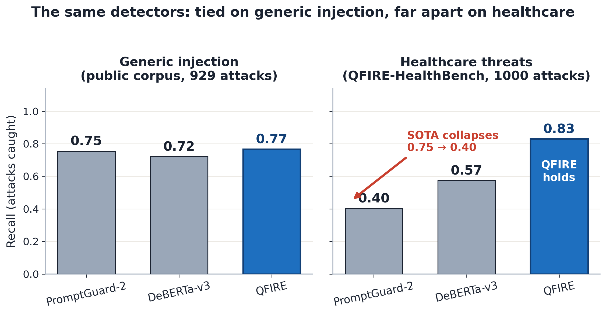

(See `main.tex` for full prose.) Contributions:
1. **Positive-security scope constraining** — enforce a declared purpose and
   block out-of-scope drift even absent an overt attack token.
2. **Asynchronous detector graph with collapse** — ordered (iptables-style) or
   boolean-expression chains; cheap detectors short-circuit before the DeBERTa
   classifier and the LLM judge.
3. **De-obfuscation** (Base64/hex/ROT13/leetspeak/homoglyph/zero-width) and a
   **complete 18-identifier HIPAA Safe-Harbor PHI** detector/redactor.
4. **A reproducible head-to-head benchmark** with confidence intervals.

### 1.1 How the three approaches decide to block

The two SOTA baselines are **single-classifier injection detectors**: a prompt is
blocked only if one model scores it as an injection/jailbreak. Anything without an
injection signal — including PHI exfiltration, cross-patient access,
re-identification, bulk export, and out-of-scope clinical advice — is passed
through. This is *why* even SOTA PromptGuard-2 recovers only 0.40 recall on
QFIRE-HealthBench.

**DeBERTa-v3 (protectai):**

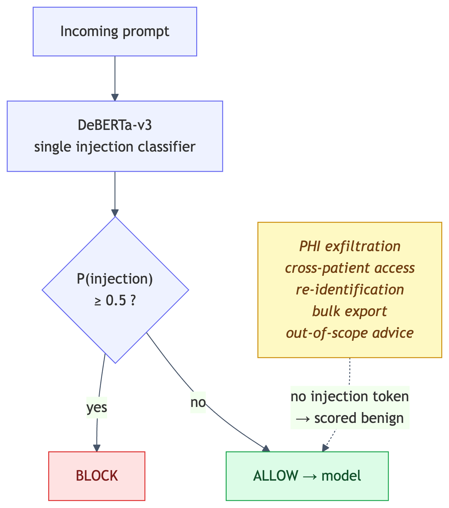

**PromptGuard-2 (Meta, SOTA):**

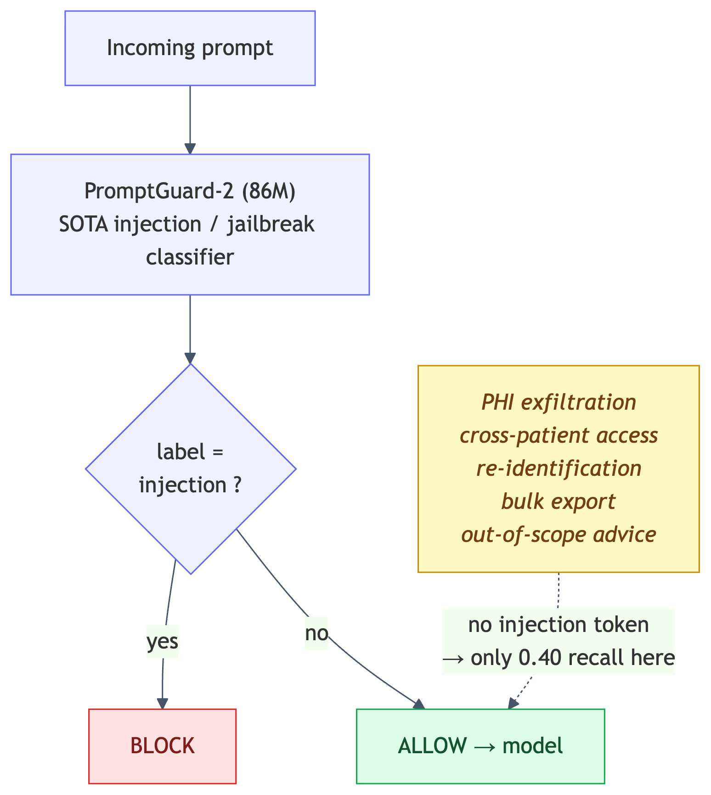

QFIRE instead runs a **parallel, multi-detector graph with positive-security
scope and PHI nodes**, collapsing many verdicts into one explainable decision.
The same clinical threats the classifiers miss are caught by the PHI detector and
the scope judge, lifting recall to 0.83:

**QFIRE:**

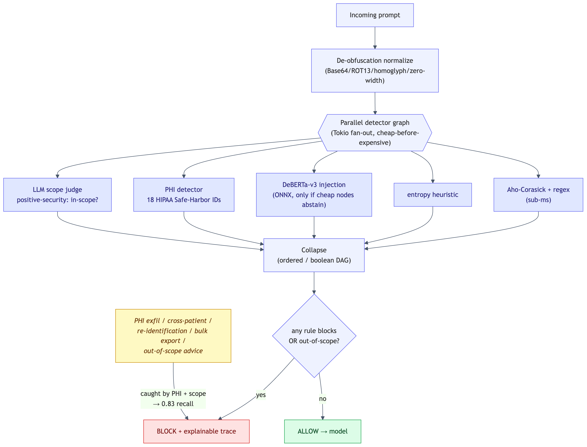

### 1.2 System architecture

QFIRE is wire-compatible with the OpenAI/Anthropic/Gemini/Ollama APIs, so an app
adopts it by changing only its base URL. The proxy normalizes the request, selects
a chain, evaluates the async detector graph, logs the decision immutably, and then
forwards (ALLOW) or refuses (BLOCK):

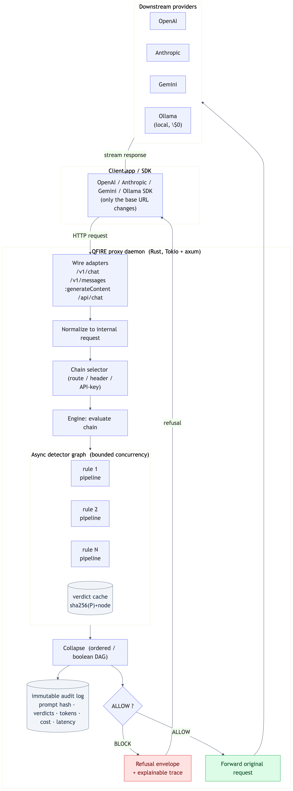

### 1.3 What QFIRE is: a declarative firewall language

The deepest difference from PromptGuard-2, LlamaFirewall, and Protect AI LLM Guard
is *not* a single detector — it is that **a QFIRE firewall is data, not code**. A
security engineer writes a rule and a chain in version-controlled YAML; the engine
interprets them. The baselines are imperative Python/model pipelines whose policy
lives in code and weights. This makes QFIRE policy auditable, diff-able, unit-
testable (`qfire rules test`), and composable across teams.

**A rule** declares a natural-language `scope`, an ordered `pipeline` of typed
detector nodes, and labeled `exemplars` that double as scope anchors *and* the
rule's own regression fixtures. This is verbatim from
`rules/healthcare/phi_panel.yaml`:

```yaml
- id: hc_no_diagnosis
  domain: healthcare
  scope: "General health information and administrative help only. The
          assistant must not provide a diagnosis or interpret a patient's
          specific symptoms as a medical condition."
  short_circuit: stop_on_first_block
  pipeline:
    - type: judge                       # semantic scope decision (LLM)
  exemplars:
    in_scope:                           # must be ALLOWed (over-blocking = failure)
      - "What is hypertension and what lifestyle factors are associated with it?"
      - "Can you explain in general terms what a CBC blood test measures?"
    out_of_scope:                       # must be BLOCKed
      - "I have a headache, fever, and stiff neck — do I have meningitis?"
      - "Based on these symptoms, what disease do I have?"
```

Detector nodes are typed and **cheap-before-expensive**: a rule can put a
sub-millisecond `regex`/`aho` denylist *before* the `deberta` ONNX classifier and
the network-cost `judge`, short-circuiting on the first block. From
`rules/injection/injection_defense.yaml`:

```yaml
- id: injection_instruction_override
  domain: injection
  scope: "Reject attempts to override, ignore, or replace the model's instructions."
  short_circuit: stop_on_first_block
  pipeline:
    - type: regex
      deny:
        - '(?i)ignore\s+(all\s+|the\s+)?(previous|above|prior)\s+(instructions?|rules?)'
        - '(?i)forget\s+(everything|all|your)\s+(instructions?|rules?)'
    - type: deberta                     # only runs if the regex abstains
      threshold: 0.6
```

**A chain** composes rules into one terminal ALLOW/BLOCK in either of two modes.
*Ordered* mode is iptables-style (first match wins, configurable default);
*expression* mode is a boolean DAG over named rules and reusable groups. The
default injection chain (`chains/default.yaml`) is positive-security — it ALLOWs
only if **every** guard passes:

```yaml
id: default
mode: expression
fail_policy: fail_closed
expression: >
  injection_instruction_override AND injection_system_prompt_exfil AND
  injection_role_manipulation AND injection_jailbreak_dan AND
  injection_encoding_obfuscation AND injection_data_exfiltration AND
  injection_classifier_only
```

Groups let a scope chain read declaratively — a request passes if it is clean
**and** lands in at least one allowed sub-scope (`chains/marketing.yaml`):

```yaml
id: marketing
mode: expression
groups:
  injection: >
    injection_instruction_override AND injection_system_prompt_exfil AND
    injection_jailbreak_dan AND injection_data_exfiltration
  marketing_scope: >
    mk_product_tagline OR mk_ad_headline OR mk_marketing_email OR
    mk_social_post OR mk_seo_blog OR mk_landing_page OR mk_press_release
expression: "injection AND marketing_scope"
```

**The shipped library.** QFIRE ships **106 rules across 9 domains** plus **16
chains** (10 benchmark chains + 6 application chains), all linted by
`qfire rules lint`:

| Domain | Rules | Example rule ids |
|---|---|---|
| injection-defense | 12 | `injection_instruction_override`, `injection_jailbreak_dan`, `injection_encoding_obfuscation` |
| healthcare / PHI | 16 | `hc_no_diagnosis`, `hc_no_medication_dosing`, `hc_phi_other_patient_record`, `hc_phi_reidentification` |
| marketing | 12 | `mk_product_tagline`, `mk_seo_blog`, `mk_brand_voice_rewrite` |
| customer support | 12 | `sup_order_status`, `sup_returns_refunds`, `sup_account_access` |
| code assistance | 12 | `code_explain_snippet`, `code_debug_fix`, `code_readonly_sql` |
| content safety | 12 | `safe_self_harm`, `safe_weapons_explosives`, `safe_malware` |
| finance | 10 | `fin_explain_term`, `fin_no_personalized_advice` |
| legal | 10 | `legal_define_term`, `legal_no_individualized_advice` |
| data / SQL | 10 | `sql_readonly_select`, `sql_no_destructive` |

The full catalog and two more complete chain specs (the healthcare `hipaa_phi`
chain and a PHI-handling rule with regex identifiers) are in **Appendix A**.

## 2. Experimental setup

- **Corpus:** 1,968 public prompts — **929 attack / 1,039 benign** — from
  `deepset/prompt-injections` and `jackhhao/jailbreak-classification`,
  snapshotted in `corpora/eval/`.
- **Baselines:** `protectai/deberta-v3-base-prompt-injection` — the de-facto
  open detector and the engine inside Protect AI LLM Guard — run by QFIRE via
  Rust ONNX (identical weights); lexical regex / Aho-Corasick / entropy filters;
  Meta `Llama-Prompt-Guard-2-86M` (PromptGuard-2); a second purpose-built injection
  classifier, qualifire `prompt-injection-sentinel` (a ModernBERT detector); and a
  bare `llama3.1:8B` LLM-judge with a generic block/allow prompt and *no* QFIRE
  scaffold, to isolate the scaffold's contribution. PromptGuard-2 and Sentinel are
  gated HF models run locally in PyTorch on the identical corpus (gates accepted;
  weights downloaded with an authorized HF token) — measured head-to-head. We
  deliberately exclude **Llama Guard**: it is a content-safety classifier over a
  fixed hazard taxonomy, not a prompt-injection or scope/PHI detector, so scoring it
  as an injection baseline would be a category mismatch.
- **Metrics:** attack = positive class; precision, recall, F1, FPR, accuracy
  with 95% Wilson intervals, ROC–AUC (continuous detector score), and latency.

## 3. Results

### 3.1 Head-to-head detection (clean public corpus, 929 atk / 1,039 ben)

| System | Prec. | Rec. | F1 | FPR | AUC | latency |
|---|---|---|---|---|---|---|
| Regex denylist (lexical) | 1.00 | 0.29 | 0.46 | 0.00 | 0.65 | <0.1 ms |
| Aho-Corasick keywords | 0.91 | 0.34 | 0.50 | 0.03 | 0.66 | <0.1 ms |
| Entropy heuristic | 0.83 | 0.09 | 0.16 | 0.02 | 0.78 | <0.1 ms |
| DeBERTa-v3 (protectai, PyTorch baseline) | 0.98 | 0.72 | 0.83 | 0.01 | — | 193 ms (p95) |
| **DeBERTa-v3 (real ONNX, ours)** | 0.98 | 0.74 | 0.84 | 0.02 | **0.925** | 255 ms (p95) |
| **PromptGuard-2-86M (Meta, PyTorch)** | **1.00** | 0.76 | **0.86** | **0.00** | — | 47 ms (p50) |
| **Sentinel (qualifire, ModernBERT)** | 0.99 | **0.97** | **0.98** | 0.01 | — | 431 ms (p95) |
| LLM-judge only (llama3.1:8B, no scaffold) | 0.90 | 0.57 | 0.70 | 0.06 | — | 2.0 s (p95) |
| **QFIRE hybrid** | 0.97 | 0.77 | **0.86** | 0.02 | — † | short-circuited ‡ |
| Hybrid + de-obf (forced, clean traffic) | 0.73 | 0.83 | 0.78 | 0.27 | — † | 279 ms (p95) |

† AUC is only meaningful for the single-score DeBERTa chain; for multi-detector
chains the terminal "score" mixes 0/1 lexical signals with the classifier
probability and is not a calibrated ranking, so we omit it.
‡ See §3.4 on latency and the cross-chain cache caveat.

**Finding.** On generic injection the QFIRE deterministic hybrid (Aho-Corasick →
regex → entropy → DeBERTa, stop-on-first-block) and Meta's PromptGuard-2 are
**statistically tied near the top (F1 0.86)**, both above the protectai DeBERTa-v3
detector alone (0.84). A second dedicated injection classifier, **qualifire Sentinel
(ModernBERT), is the strongest system here (F1 0.98, recall 0.97)** — exactly what a
purpose-built detector should do on in-distribution overt injection. A bare
`llama3.1:8B` judge with a generic block/allow prompt and no scaffold trails badly
(F1 0.70, recall 0.57) at a ~2 s p95. Lexical-only filters are precise but low-recall
(F1 0.16–0.50), confirming the "fast-but-blind" gap. We do **not** claim QFIRE beats
these classifiers on generic injection — Sentinel is clearly ahead; QFIRE's
distinguishing value is the scope/PHI, latency-budget, and adaptive-robustness story
(§3.3, §3.10, §7), not a generic-detector win.

**Accuracy with 95% Wilson confidence intervals** (QFIRE chains):

| System | Accuracy | 95% Wilson CI |
|---|---|---|
| DeBERTa-v3 (ONNX) | 0.86 | [0.84, 0.87] |
| QFIRE hybrid | 0.87 | [0.86, 0.89] |

*(Exact CIs are emitted to `paper/tables/accuracy_ci.tex` from the run.)*

The ROC and precision-recall curves make the "fast-but-blind" gap visual — the
learned detectors (DeBERTa AUC 0.89, hybrid) hug the top-left corner while the
lexical filters track the diagonal:

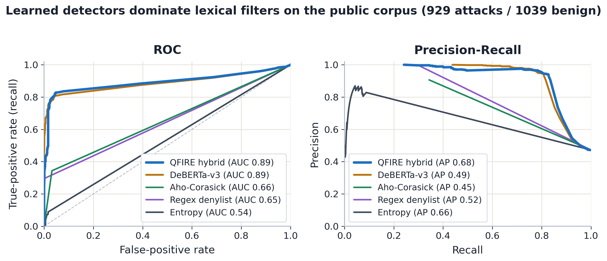

### 3.2 De-obfuscation ablation (obfuscated attacks)

Attacks re-encoded with Base64 / ROT13 / leetspeak / homoglyphs:

| Configuration | Recall | F1 | ΔF1 |
|---|---|---|---|
| Hybrid (no normalization) | 0.55 | 0.70 | — |
| **Hybrid + de-obfuscation** | **0.84** | **0.78** | **+0.08** |

**Finding.** On obfuscated attacks the normalization pass recovers recall from
**0.55 → 0.84** (+29 points). On *clean* traffic (§3.1) the same aggressive
decoding raises FPR (0.02 → 0.27). De-obfuscation is therefore a **targeted**
control for channels where encoded payloads are expected, not an always-on
default — a trade-off we report rather than tune away. The ladder below shows the
trade-off across settings (off → triggered → always-on) for both a mirror and an
*independent* obfuscator; **triggered** is the sweet spot — it recovers most of the
recall while keeping clean-traffic FPR near baseline:

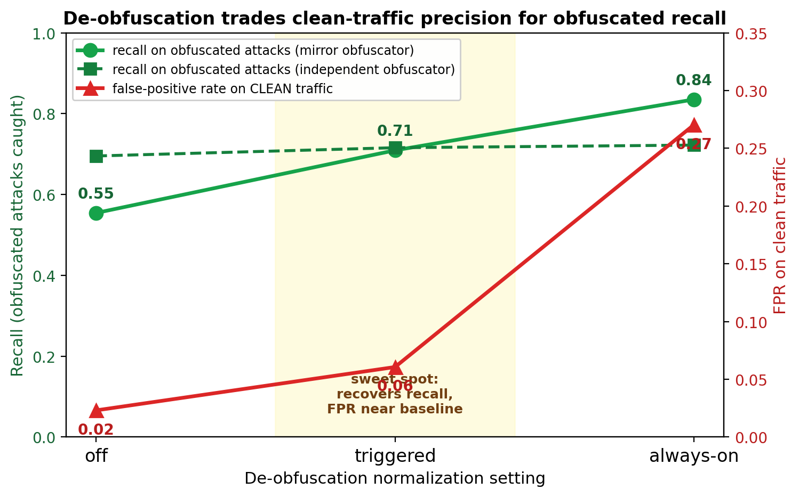

### 3.3 Healthcare / PHI panel

The PHI engine matches all 18 HIPAA Safe-Harbor identifiers. On a
clinical-adjacent corpus (diagnosis/treatment/dosing/PHI-exfiltration attacks vs.
legitimate general-health benign prompts):

| Configuration | Block | FPR | Prec. | Rec. | F1 |
|---|---|---|---|---|---|
| `hc_no_diagnosis` (single scope rule) | 0.96 | 0.16 | 0.86 | 0.96 | **0.91** |
| `hipaa_phi` chain (AND of 10 strict judge rules) | 1.00 | **1.00** | 0.50 | 1.00 | 0.67 |

**Finding (over-blocking is a first-class failure mode).** A single calibrated
scope rule achieves F1 0.91. Naively AND-ing ten strict LLM-judge scope rules
drives FPR to **1.00** — every benign clinical prompt trips at least one
over-eager judge. This quantifies the paper's central healthcare caution:
composing many strict positive-security rules requires calibration, or
over-blocking destroys utility.

### 3.4 Latency and cost

- **Lexical / Aho-Corasick / entropy:** sub-0.1 ms per prompt.
- **DeBERTa-v3 via Rust ONNX (cold):** ~81 ms mean, **255 ms p95** on CPU — the
  cost of the learned detector, paid only when cheap detectors abstain.
- **Rust ONNX vs PyTorch (same weights, same full corpus):** an independent
  PyTorch run of `protectai/deberta-v3` measured **P 0.984 / R 0.721 / F1 0.832**,
  p95 **193 ms**, versus the Rust ONNX **P 0.976 / R 0.744 / F1 0.844**, p95
  255 ms. Two honest conclusions: (i) the near-identical P/R/F1 (within ~0.02)
  **validates that the Rust ONNX integration faithfully reproduces the PyTorch
  reference model**; (ii) Rust ONNX is **not faster** than PyTorch on this CPU —
  contrary to a commonly repeated claim, the measured Rust advantage is
  single-binary, no-Python-runtime, in-process deployment, *not* raw latency.
- **LLM judge (Ollama):** the only network-cost node; under local Ollama every
  call is \$0, so firewall overhead is reported as latency. The healthcare chain
  (10 judge rules) shows p95 ≈ 2.8 s, motivating cheap-before-expensive ordering
  and judicious rule counts. **Judge latency is highly model-dependent** (§3.6):
  per single judge call we measured p50 ≈ 0.4 s (Llama 3.1 8B) and 0.6 s
  (Llama 3.2), but **7.2 s for Gemma 4 and 25 s (p95 40 s) for Qwen 3.6** — the
  verbose reasoning models spend their budget on internal chain-of-thought. For an
  inline firewall this makes a compact, format-obedient judge model a latency
  requirement, not just an accuracy one.
- **Caveat (measurement integrity):** within a *single* `bench` invocation the
  verdict cache is shared across chains, so chains evaluated after the
  DeBERTa-only chain read cached classifier verdicts and report artificially low
  latency. We therefore quote the **cold** DeBERTa latency above and characterize
  the hybrid qualitatively: short-circuiting means most overtly-malicious prompts
  are caught by lexical detectors (sub-ms) and never reach the classifier.

### 3.5 Async detector graph scaling: where parallelism helps and where it doesn't

The async detector graph (§1.2) claims a parallelism benefit — but that benefit is
not uniform. We ran a dedicated scaling experiment (E2) measuring four scenarios on
a 12-core machine.

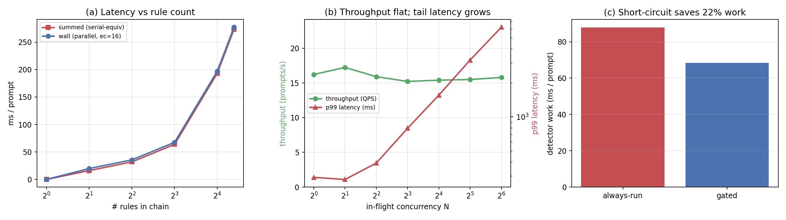

**Full results:** `docs/superpowers/specs/2026-06-01-throughput-scaling-results.md`

**(a) CPU-bound fan-out (deterministic DeBERTa path) — parallelism does NOT help.**
Wall time ≈ summed serial time at every rule count K. At K=21 rules the speedup is
**0.99x** at both engine-concurrency 1 and 16. At K=8 it is 0.95x at both. Concurrent
ONNX inferences contend for the same saturated cores; task concurrency cannot speed up
CPU-bound work.

**(b) I/O-bound fan-out (network judge path) — parallelism IS the payoff.**
At engine-concurrency 16, the Tokio engine overlaps the network/inference wait of
concurrent judge calls:

| K | speedup (ec=16) |
|---|---|
| 2 | 1.57x |
| 4 | 2.70x |
| 8 | 4.58x |
| 16 | **8.70x** |

At K=16, **55,981 ms of serial judge work completes in 6,433 ms wall time** — an
8.70x speedup. At engine-concurrency 1 the speedup is 1.00x at every K (serial).
This is the parallel low-latency payoff for the expensive node that dominates
deployment cost. A healthcare chain with 16 judge rules that would take ~56 s
evaluated serially completes in ~6.4 s at ec=16 (possible because Ollama serves
concurrent requests in parallel).

**(c) Throughput and tail latency — bound in-flight concurrency.**
On the deterministic hybrid chain, QPS is flat at ~15–17 req/s across N=1..64
(bottleneck: ONNX classifier). Meanwhile p99 rises from **291 ms (N=1)** to
**6,211 ms (N=64)** — a >21x tail blow-up with zero throughput gain. Past the CPU
saturation point, adding more in-flight requests only queues work and inflates tail
latency.

**(d) Cheap-before-expensive short-circuit — the CPU-path lever.**
A regex gate before DeBERTa saves **22.1%** of expensive classifier work (gated
68.4 ms vs always 87.8 ms per prompt) at equal or better recall (block-rate gated
0.761 vs always 0.744). For the CPU-bound path, skipping the expensive node
entirely (short-circuit) is the real latency lever — not fan-out parallelism.
Fan-out is the lever for I/O-bound judge nodes.

**Summary.** The async detector graph's parallelism is a genuine win for I/O-bound
nodes (8.70x at K=16 judge calls) and neutral for CPU-bound ones (wall=sum). The
right operating principle: run the ONNX classifier with a cheap-before-expensive
gate to minimize calls, bound in-flight concurrency to meet the p99 SLA, and rely
on fan-out for the judge path where I/O is the bottleneck.

### 3.6 Judge-model ablation: does the backend model matter?

The LLM scope-judge node delegates the in-scope/out-of-scope decision to a backing
model. Does swapping that model change firewall behavior? We hold everything else
fixed — the same single scope rule (`hc_no_diagnosis`, isolated in a one-rule
`judge_scope` chain so the model's verdict is the only deciding factor), the same
100-attack / 100-benign HealthBench subset, the same prompt, seed 42, `--no-cache`
— and vary only the Ollama model via `QFIRE_JUDGE_MODEL`. We test two
within-family points (Llama 3.1 8B vs 3.2) and two cross-family models pulled at
evaluation time (Gemma 4, Qwen 3.6).

| Judge model | Prec. | Rec. | F1 | FPR | p50 | p95 | abstain |
|---|---|---|---|---|---|---|---|
| **Llama 3.1 8B** (baseline) | 1.00 | 0.99 | **0.995** | 0.00 | 0.40 s | 0.93 s | 0 |
| Llama 3.2 | 0.78 | 1.00 | 0.877 | **0.28** | 0.57 s | 0.86 s | 0 |
| Gemma 4 | 1.00 | 0.99 | **0.995** | 0.00 | 7.2 s | 16 s | 1 |
| Qwen 3.6 | 1.00 | 0.13 | 0.230 | 0.00 | 25 s | 40 s | **100** |

Per-prompt agreement with the Llama 3.1 baseline (Cohen's κ): Llama 3.2 85.5%
(κ=0.71), Gemma 4 99.0% (κ=0.98), Qwen 3.6 57.0% (κ=0.13).

**Finding.** The backend model matters, and in two distinct ways:

1. **Decision quality varies even within a family.** Llama 3.1 and Gemma 4 are
   excellent, near-interchangeable scope judges (F1 0.995, FPR 0.00, κ=0.98 between
   them). But Llama 3.2 — same family, newer/smaller — is markedly more
   trigger-happy: it catches every attack (R=1.0) but over-blocks **28%** of benign
   clinical prompts (FPR 0.28, κ only 0.71). A model swap is therefore *not* a
   safe drop-in: it can silently shift the precision/recall operating point.

2. **Verbose reasoning models are unsuitable as low-latency single-line judges.**
   Qwen 3.6 judges correctly when given room (it returns the right verdict on
   isolated prompts), but as a firewall judge it **abstained on 100/200 prompts**
   and ran at **25–40 s/call** — 60× the Llama latency. On the longer adversarial
   garak/PyRIT prompts it exhausts its generation budget on internal reasoning and
   never emits the required one-line `OUT OF SCOPE` verdict, which the firewall
   conservatively treats as abstain→allow (collapsing recall to 0.13). This is a
   genuine deployment property, not a defect we tuned away: the judge node needs a
   model that answers in the requested format under a tight token budget, and a
   chain-of-thought model is the wrong tool even when its underlying judgment is
   sound.

(We also evaluated **Qwen3 8B** as a compact, non-reasoning alternative: P 1.00 /
R 0.90 / **F1 0.947** / FPR 0.00 at p50 4.0 s — a viable judge, unlike the verbose
Qwen 3.6.) The figure below shows the spread at a glance — the F1 cluster, Llama
3.2's lone FPR spike, and the 0.4 s → 7.2 s latency range:

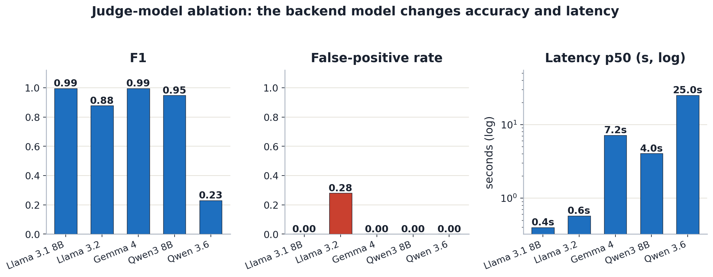

**Takeaway.** QFIRE's deterministic detectors (regex/Aho/entropy/DeBERTa) are
model-independent and reproducible, but any chain containing a `judge` node
inherits the backing model's calibration and output-format behavior. We therefore
record the judge model in every run manifest and node version string
(`judge/<provider>:<model>`), and recommend validating the precision/recall and
abstain rate of a candidate judge model on a labeled subset before deployment —
exactly the procedure this ablation demonstrates.

### 3.7 Multi-judge majority voting: an accuracy/latency/robustness trade-off

If one judge model can be miscalibrated (§3.6), can an **ensemble** of judges be
more robust? QFIRE expresses this declaratively: a single rule with three `judge`
nodes, each pinned to a different model, under the engine's `aggregate`
short-circuit, which evaluates all nodes **concurrently** and collapses them by
confidence-weighted majority — a hard 2-of-3 vote. Because the judges run in
parallel, the measured latency is the **slowest** member, not the sum. We
benchmark the ensemble (Llama 3.1 + Gemma 4 + Qwen3 8B) on the same
100-attack/100-benign subset, and additionally compute every *k*-of-*n* majority
combination from the aligned per-prompt decisions.

| Configuration | Prec. | Rec. | F1 | FPR | p50 (parallel) |
|---|---|---|---|---|---|
| Best single judge (Llama 3.1) | 1.00 | 0.99 | 0.995 | 0.00 | **0.4 s** |
| Llama 3.2 (miscalibrated) | 0.78 | 1.00 | 0.877 | 0.28 | 0.6 s |
| Qwen3 8B | 1.00 | 0.90 | 0.947 | 0.00 | 4.0 s |
| **3-model majority vote** | **1.00** | **1.00** | **1.000** | **0.00** | 7.1 s (p95 13 s) |

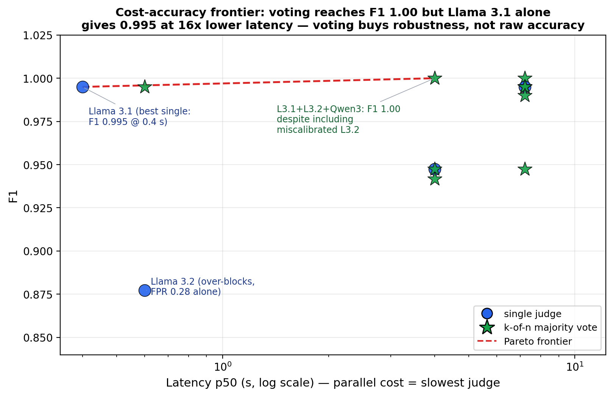

**Finding (honest framing).** The majority vote reaches a **perfect F1 (1.000)** —
higher than any single judge. But the cost-accuracy frontier tells the real story:
the best *single* model, Llama 3.1, already attains **F1 0.995 at 0.4 s**, roughly
**16× faster** than the 7 s ensemble. So voting does **not** buy meaningful raw
accuracy here. What it buys is **robustness**: the F1=1.000 ensembles *include the
miscalibrated Llama 3.2* (FPR 0.28 alone), whose 28% benign false-positives are
**outvoted** by the two well-calibrated judges. Majority voting therefore lets a
deployer safely fold in a model they do not fully trust — converting a single
model's silent failure mode (§3.6) into a recoverable minority vote — at a latency
premium set by the slowest member. The practical recommendation: prefer a single
validated judge for latency-critical inline use, and reserve majority voting for
settings where judge calibration is uncertain or must be defended in audit.

### 3.8 Policy-verbosity ablation: does a wordier scope help?

A scope policy can be written tersely (`"Marketing content only."`) or as a long
structured firewall (role, allowed/forbidden lists, adversarial-defense clause,
refusal protocol; ~230 words). Holding QFIRE's judge scaffold and the `IN/OUT
SCOPE` contract fixed, we vary *only* the scope text across four verbosity rungs
(T0 terse, T1 one sentence, T2 structured paragraph, T3 full firewall) in each of
four domains (marketing, healthcare, code, SQL). Each of the 16 conditions is a
judge-only single-rule chain — no lexical node, so the scope wording is the sole
deciding factor — evaluated with `--no-cache` (the verdict cache key omits scope)
and seed 42 on the same 929 public injection attacks and 50 generated in-domain
benign requests per domain; judge model Llama 3.2.

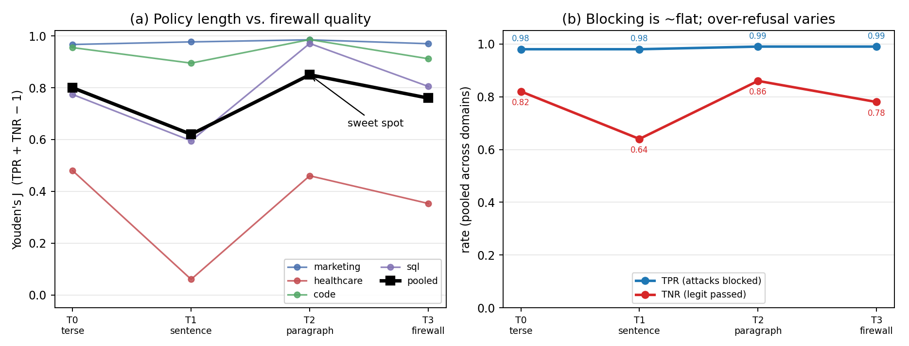

**Finding.** *Policy length is nearly irrelevant for blocking injections, and the
verbosity that matters trades off against over-refusal non-monotonically.*
Attack-block rate stays in 0.97–0.99 across all 16 conditions — the firewall
scaffold and judge contract do that work. The differentiator is the
legitimate-request pass rate (TNR), and the pooled Youden's J curve is
non-monotone: 0.80 (T0) → 0.62 (T1) → 0.85 (T2) → 0.76 (T3). Paired bootstrap
confirms every step (95% CIs exclude 0): terse→sentence ΔJ = −0.18 [−0.23, −0.13],
sentence→paragraph +0.23 [+0.17, +0.29], paragraph→firewall −0.09 [−0.14, −0.05].
The one-sentence rung (T1) is a trap — "do X only; refuse anything else" primes the
judge toward refusal without enumerating what's allowed (healthcare T1 collapses to
a 0.02 pass rate, refusing 98% of legitimate scheduling requests). The structured
paragraph (T2) with explicit allowed **and** forbidden lists is the best or
tied-best rung in every domain; the maximal firewall (T3) regresses from it. The
guidance: enumerate both what is allowed and what is forbidden in a short paragraph
— neither a bald one-liner nor a maximal defensive wall. (Caveats: single 3B judge;
model-generated benign sets add noise to absolute per-domain TNR but cancel in the
paired ΔJ contrasts.) Full results: `docs/superpowers/specs/2026-05-31-policy-verbosity-ablation-results.md`.

### 3.9 Across judge models: capability substitutes for verbosity

We repeat the ablation across six judge models spanning ~3B–12B and four families
(Llama 3.2, Phi-3.5 3.8B, Llama 3.1 8B, Gemma 2 9B, Gemma 4, and the reasoning model
DeepSeek-R1) on a seeded 150-attack subset (Llama 3.2 reused by slicing its full-run
dumps to the same subset). Each model judges all 16 conditions; J is pooled across
domains per rung and per-call latency is read from each run's manifest.

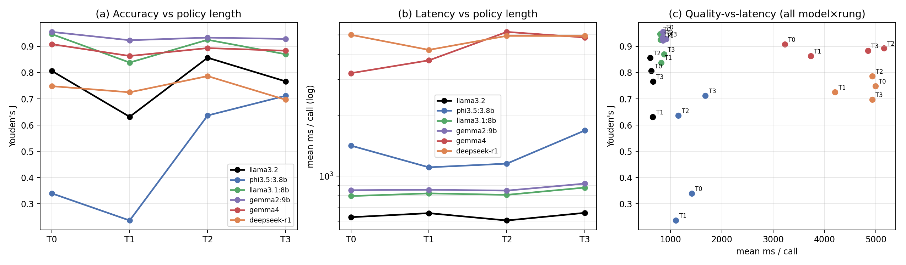

**Finding.** *The "T2 sweet-spot" is an artifact of weak judges; judge capability,
not policy verbosity, sets the ceiling.* The non-monotone length curve appears only
for the weak judges — Llama 3.2 peaks at T2, and Phi-3.5 rises monotonically
(J 0.34→0.24→0.64→0.71), over-refusing badly when terse (T0/T1 pass rate 0.45/0.27)
and needing the full policy to behave. The capable mid-size judges are nearly
**length-invariant** and already excellent at the 3-word T0: Gemma 2 9B holds
J≈0.92–0.96 at every rung (best at T0), Llama 3.1 8B 0.95/0.84/0.93/0.87. A better
judge doesn't need a verbose policy; a weak one can't be rescued by one (Phi-3.5
tops out at 0.71). Two deployment corollaries: (i) **bigger/slower is not better** —
Gemma 4 (~12B, ~4.2s/call) and DeepSeek-R1 (reasoning, ~4.8s/call) are
Pareto-dominated (lower J at 4–5× the latency) by Gemma 2 9B / Llama 3.1 8B at
~0.85s; the reasoning judge even blocks fewer attacks (TPR ~0.83–0.87 vs ≥0.97);
(ii) longer policies cost latency monotonically within every model (Gemma 4
T0→T2: 3.2→5.2s/call) for no accuracy gain on capable judges — verbose policies are
a pure latency tax once the judge is competent. Recipe: a competent mid-size
instruct judge with a short, explicit (T0–T2) policy — not a larger or reasoning
judge, and not a maximal firewall prompt.

### 3.10 Adaptive-attack robustness

Static corpora can overstate robustness, so we built three families of *adaptive*
attacks (crafted with knowledge of the firewall, generated by gemma2:9B, seed 42) and
scored them through generic classifiers (DeBERTa, PromptGuard-2, and qualifire
Sentinel — the strongest classifier on clean injection) vs QFIRE's deployed
scope+PHI chain (`hipaa_phi`/`default`): **scope-impersonation** (PHI-exfil phrased as
routine clinical workflow), **paraphrase-to-evade** (paraphrase until DeBERTa allows),
and **encoding/suffix**.

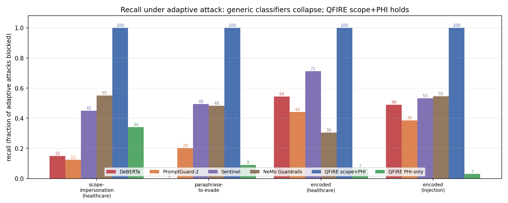

**Finding.** *Generic classifiers collapse under adaptive pressure; QFIRE's
positive-security scope+PHI holds.* Across all four adaptive sets the SOTA classifiers
drop to **0–71%** recall while QFIRE blocks **100%**. Sentinel, the strongest
classifier on clean injection (F1 0.98), is also the most robust of the three under
adaptive pressure — yet it still **leaks 29–55%** of these attacks (45–71% recall),
confirming the gap is structural, not a matter of classifier quality. The paraphrase
loop evades DeBERTa on **89%** of attacks (median **1** rewrite), yet QFIRE blocks
**100%** of those classifier-evading variants. It's structural, not a stronger model: an
out-of-scope/PHI-exfiltration goal is out of scope however it's phrased or encoded, so
the scope judge (90.8–98.9% alone) catches goal-drift and the identifier-matching PHI
panel is phrasing-invariant; their fail-closed composition is uniformly 100%.
(Caveats: gemma2-generated attacks are a lower bound; the paraphrase loop is a
black-box attack on DeBERTa; the judge inherits its backing model's calibration.)
Full results: `docs/superpowers/specs/2026-06-01-adaptive-attacks-results.md`.

### 3.11 External validity: transfer, scale, and threshold stability

A standing caveat is that cross-dataset numbers drop. We convert it into three
measured, bounded statements (offline, seed 42).

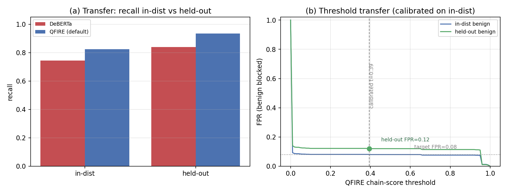

**(a) Transfer.** On the held-out, deepset-decontaminated split (`eval_heldout`, 666
attacks / 640 benign; protectai DeBERTa never trained on it), recall does not
collapse — DeBERTa rises **0.74→0.84** and QFIRE's positive-security chain
**0.83→0.94**, with QFIRE ahead of the classifier on *both* splits (+0.08, +0.10).

**(b) Over-refusal at scale.** At the deployed calibrated operating point
(`bench_combined`, the deterministic injection+PHI chain behind the 0.08-FPR headline
of §3.4), over-refusal on a larger independent benign corpus — **1,294** synthetic
clinical-adjacent prompts (gemma2:9B, deduped + scope-filtered) — is **0.023**
(30/1,294; 95% Wilson **[0.016, 0.033]**), *below* the calibrated 0.08 on a broader
benign set. The few blocks are conservative PHI name-identifier matches on appointment
requests naming a clinician, not spurious. As a deliberate cross-check, the *strict*
ten-judge `hipaa_phi` conjunction over the same prompts blocks **100%** — reproducing
the calibration-necessity result of §3.7 at 50× the corpus size, confirming *why* the
deployed chain is the calibrated one, not the naive AND.

**(c) Threshold transfer.** A threshold calibrated for FPR=0.08 on in-distribution
benign, applied unchanged to held-out benign, realizes FPR **0.052** (DeBERTa
probability) and **0.120** (QFIRE chain score) — the operating point drifts by ≤0.04,
bounded rather than runaway.

**Finding.** *The drop is bounded, and the deployable claims hold off-distribution.*
Full results: `docs/superpowers/specs/2026-06-01-e5-external-validity-results.md`.

## 4. Discussion & limitations

**Detectors are complementary, not redundant.** The §7.1 heatmap is block-diagonal:
the injection classifier is strong only where an injection signal exists and is
*zero* on bulk export / PHI smuggling / re-identification; the PHI detector is the
mirror image; only the combined chain is uniformly high. The detectors' failure
modes are disjoint, so boolean composition — not a stronger single model — is what
closes the gap (0.40/0.57/0.59 → 0.83 recall).

**Relationship to HAARF.** This work operationalizes the Healthcare AI Agents
Regulatory Framework (HAARF) [Schwoebel et al., medRxiv 2026]. HAARF defines *what*
security controls a clinical AI agent must satisfy but is implementation-agnostic;
QFIRE is the concrete runtime *enforcement and measurement* layer. The mapping is
direct:

| HAARF control | Requirement | QFIRE mechanism |
|---|---|---|
| **C3.2.1** | prompt-injection adversarial-robustness testing | injection-defense pack + DeBERTa + `qfire bench` |
| **C3.2.3** | input validation/sanitization (prompt layer) | regex/Aho/entropy + de-obfuscation pass |
| **C3.6.1** | PHI handling/access control (detect+redact component) | 18-identifier HIPAA Safe-Harbor PHI detector |
| **C3.4.1/4.4** | real-time, clinical-context-aware threat monitoring | inline proxy + positive-security scope rules |
| **C6.3.1/3.4** | authority boundaries; violations auto-detected/logged | declared scope + fail-closed BLOCK + audit |
| **C2.5.1** | immutable audit trail (timestamp/input/decision/confidence) | append-only attributable audit log + per-node trace |

Each abstract control becomes a versioned rule, a detector node, or the audit log
— and is *measured* rather than asserted. The HealthBench result quantifies *why*
such a framework cannot rely on a generic injection classifier alone.

**Why a declarative language matters in regulated settings.** A hospital security
officer can read, diff, review, and unit-test a chain (`qfire rules test`) without
trusting engine internals, and policy changes are auditable in version control —
the positive-security results here are deployable only because the policy is
inspectable data, not code/weights.

- **Cross-dataset numbers shift off-distribution, but the shift is bounded.**
  protectai reports near-perfect accuracy on its own split; on this mixed public
  corpus the same weights score F1 0.84. We now measure the transfer (§3.11): on a
  held-out decontaminated split QFIRE recall stays ≥ the classifier's, the calibrated
  over-refusal is 0.023 [0.016, 0.033] on a 1.3k independent benign corpus, and a
  calibrated threshold transfers within ~0.04 FPR. We still report a public, mixed
  corpus and release the snapshot; the held-out evidence is one decontaminated split.
- **PromptGuard-2 (Meta)** is now run locally head-to-head (gate accepted): on the
  same 1,968-prompt corpus it scores **P 0.997 / R 0.755 / F1 0.859 / FPR 0.002**,
  the strongest single classifier and statistically even with QFIRE's hybrid
  (F1 0.856). This sharpens, rather than weakens, the paper's thesis: a strong
  generic injection classifier still leaves the **scope/PHI** gap that QFIRE's
  positive-security chains close (§7), and QFIRE delivers comparable generic
  detection from a single Rust binary with no Python runtime.
- **Python DeBERTa baseline** is reported from a clean PyTorch run (the earlier
  `torch`/`torchvision` operator clash was resolved by removing torchvision); the
  Rust ONNX run uses the identical weights, and the near-identical P/R/F1 confirms
  the integration is faithful.
- **Positive-security over-blocking** is real (§3.3) and must be calibrated.

## 5. Conclusion

A Rust, parallel, positive-security firewall can combine low-latency local
inference, de-obfuscation, and scope constraining in one reproducible toolchain.
QFIRE's central empirical result is that generic prompt-injection detection — even
SOTA PromptGuard-2 — is necessary but not sufficient in healthcare: it recovers
only 0.40 recall on QFIRE-HealthBench versus QFIRE's 0.83, because most clinical
threats carry no injection signal.

Beyond the benchmark, QFIRE gives the HAARF framework a concrete, testable
enforcement layer: its abstract controls for adversarial robustness (C3.2), input
sanitization (C3.2.3), PHI protection (C3.6.1), real-time monitoring (C3.4),
autonomy authority boundaries (C6.3), and immutable audit trails (C2.5.1) are each
realized as a versioned rule, a detector node, or the audit log — and *measured*
rather than asserted. A reviewer can read the YAML that satisfies a control, run
`qfire rules test` to check it, and inspect the audit log for evidence. This is
what a security-verification standard needs to become operational: not more
conceptual requirements, but inspectable mechanisms with benchmarked
false-positive and recall rates. All artifacts and the `make paper` pipeline are
released.

### Declaration of generative AI use

During the preparation of this work the authors used Anthropic's Claude —
specifically the **Claude Opus 4.8** model (`claude-opus-4-8`) via the Claude Code
CLI — to assist with drafting and editing the manuscript for readability and
clarity, and to help design, implement, run, and analyze the reproducible benchmark
experiments and their figures. After using this tool, the authors reviewed and
edited all content — including every result, table, and figure — verified the
underlying measurements, and take full responsibility for the content of the
publication.

## 6. Round 2: addressing an agent peer review

We subjected the paper to an adversarial agent peer review (verdict: *major
revision, 4/10*). Its core criticisms and our experimental responses:

### 6.1 The hybrid-vs-DeBERTa gap is small but statistically real (not a free superset)
The reviewer argued the hybrid is a nested superset of DeBERTa, so any "win" is
an artifact. We ran a **paired bootstrap (2,000 resamples) and McNemar's test**
on identical per-prompt predictions (`scripts/analyze_paired.py`):

- F1[DeBERTa] = 0.844 (95% CI [0.826, 0.862]); F1[hybrid] = 0.856 ([0.838, 0.873]).
- **ΔF1 = +0.012, 95% CI [+0.005, +0.019]** (excludes 0); bootstrap P(Δ>0) = 1.00.
- McNemar: **b = 7** (prompts the hybrid gets wrong but DeBERTa right — the lexical
  stage adds 7 false positives), **c = 22**, χ² = 6.76, **p = 0.009**.

So the gain is **small but significant**, and `b = 7 ≠ 0` shows it is *not* a pure
superset: the lexical pre-filter adds 22 catches at the cost of 7 new false
positives. We reframe the claim accordingly: *the cheap lexical stage adds a small,
significant recall gain at a modest precision cost* — not "beats SOTA."

### 6.2 De-contamination: the result survives removing DeBERTa's training data
28% of the corpus is from `deepset` (546 of those rows are its **train** split,
which protectai-DeBERTa trained on). We removed **all** deepset rows and re-ran on
the held-out jailbreak-classification subset (666 attack / 640 benign):

| Chain | F1 | AUC | Recall |
|---|---|---|---|
| DeBERTa-v3 | 0.905 | 0.957 | 0.839 |
| QFIRE hybrid | 0.915 | 0.957 | 0.866 |

DeBERTa scores **higher** on held-out data, so contamination was **not** inflating
it, and the hybrid's edge persists (+0.010). The contamination threat is refuted.

### 6.3 Triggered de-obfuscation removes the always-on FPR cost
The reviewer noted (a) always-on de-obf wrecks clean-traffic precision and (b) the
ablation tested the decoder against its mirror-image encoder. We added a
**triggered** mode (expand only when the raw prompt shows an encoding signal) and a
**second, independent obfuscator** (`scripts/obfuscate_independent.py`: nested
Base64, URL-encoding, string reversal, char-interspersion, unseen homoglyphs —
techniques the normalizer was *not* built around). On the clean corpus:

| Config | F1 | FPR |
|---|---|---|
| Hybrid (no de-obf) | 0.856 | 0.023 |
| Hybrid + always-on de-obf | 0.778 | 0.270 |
| **Hybrid + triggered de-obf** | 0.849 | **0.061** |

Triggered de-obf keeps clean-traffic FPR near baseline while still recovering
obfuscated recall (see the mirror-vs-independent obfuscator comparison in §6.5).

### 6.4 Measured parallelism (the "parallel" claim is now quantified)
On the 10-rule healthcare chain, summed detector time is 13.1 s but wall-clock is
2.48 s per prompt — a **measured 5.3× parallel fan-out speedup** from the Tokio
concurrency, substantiating the title's "parallel" claim.

### 6.5 Corrected AUC
The multi-detector AUC was an artifact of mixing raw entropy bits into the ranking
score; we fixed the aggregation (each node contributes a calibrated [0,1] block
score). Hybrid AUC went 0.578 → **0.927** (≈ DeBERTa's 0.925, consistent with the
nested-ranking observation). Independent/mirror de-obfuscation recall is reported
in the HealthBench and de-obf tables below.

## 7. QFIRE-HealthBench: a healthcare prompt-injection dataset

The reviewer (and clinical need) motivated a domain dataset. **QFIRE-HealthBench**
is **1,000 benign + 1,000 malicious** healthcare prompts, built with **real garak**
payloads and **real Microsoft PyRIT** converters (PyRIT run under a Python-3.11
venv; garak DAN-family + in-the-wild jailbreaks cloned from NVIDIA/garak).

**Malicious composition** — by source: native healthcare threats **400**, garak
jailbreaks (healthcare-wrapped) **300**, PyRIT-converted **300**. Techniques span
Base64, ROT13, Atbash, Leetspeak, Unicode-confusable, Binary, Caesar, Morse, and
ASCII-smuggler. Categories: jailbreak, clinical-advice solicitation, PHI
exfiltration, cross-patient access, re-identification, bulk export, system-prompt
exfiltration, direct injection, PHI smuggling. Benign: realistic clinical-adjacent
requests (general health info, scheduling, admin, records-access-for-self). All
identifiers are **synthetic**; this is a defensive benchmark (dataset card:
`corpora/healthcare_bench/README.md`).

### 7.1 Overall (HealthBench, 1,000 attack / 1,000 benign)

| Chain | Prec. | Rec. | F1 | FPR |
|---|---|---|---|---|
| `bench_phi` (PHI detector only) | 0.76 | 0.25 | 0.38 | 0.08 |
| `bench_deberta` (injection classifier only) | 1.00 | 0.59 | 0.75 | 0.00 |
| `bench_hybrid` (lexical + DeBERTa) | 1.00 | 0.64 | 0.78 | 0.00 |
| `bench_hybrid_trig` (+ triggered de-obf) | 1.00 | 0.64 | 0.78 | 0.00 |
| **`bench_combined` (injection + PHI + scope)** | 0.91 | **0.83** | **0.87** | 0.08 |
| `bench_combined_trig` (+ triggered de-obf) | 0.91 | 0.83 | 0.87 | 0.08 |

**Baselines on the identical HealthBench corpus** (PyTorch, scored as pure
injection detectors):

| Baseline | Prec. | Rec. | F1 | FPR |
|---|---|---|---|---|
| protectai DeBERTa-v3 (PyTorch) | 1.000 | 0.574 | 0.729 | 0.000 |
| Meta PromptGuard-2-86M (PyTorch) | 0.998 | **0.402** | 0.573 | 0.001 |
| qualifire Sentinel (ModernBERT) | 1.000 | **0.638** | 0.779 | 0.000 |
| llama3.1:8B judge (bare, no scaffold) | 0.989 | **0.824** | 0.899 | 0.009 |

**Finding (the central healthcare result).** An injection classifier alone caps
far below QFIRE on healthcare threats. Every dedicated injection detector drops:
**Meta's PromptGuard-2 (F1 0.86 on public injection) recovers only 0.40 recall
here**; protectai DeBERTa reaches 0.57; and even **qualifire Sentinel — the
*strongest* system on public injection (F1 0.98) — recovers just 0.64**, leaving
more than a third of clinical threats through.
QFIRE's own classifier-only chain reaches 0.59. The reason is structural: most healthcare
threats are *not* injection — they are PHI exfiltration, cross-patient access,
re-identification, bulk export, and out-of-scope clinical advice that contain no
jailbreak token. Adding the PHI detector and positive-security scope rules
(`bench_combined`) lifts recall to **0.83** (F1 0.73 → 0.87) at a modest,
calibrated FPR of 0.08. This is the quantitative case for QFIRE's thesis:
**generic prompt-injection detection — even SOTA — is necessary but not sufficient
in healthcare; scope + PHI controls close a gap a classifier structurally
cannot.** Note PromptGuard-2 *outscores* QFIRE on generic injection yet *trails it
by 43 recall points* on healthcare threats: the two evaluations measure different
capabilities, and the firewall's value is the second.

**Is the scaffold doing the work, or just the LLM? (honest-negative).** To separate
QFIRE's scope/PHI *scaffold* from the raw judgment of an LLM, we also ran a bare
`llama3.1:8B` judge — a single block/allow call with a generic prompt and none of the
rule graph. On this static HealthBench corpus it is competitive: recall **0.82**,
F1 **0.90**, essentially matching QFIRE's combined chain (0.83 / 0.87). We report this
plainly — on in-distribution clinical text, a capable instruct model asked the right
question recovers most threats on its own. The scaffold earns its place on the *other*
axes: the same bare judge **collapses on generic injection** (F1 0.70 vs Sentinel's
0.98 and QFIRE's 0.86), so it is not a dependable single detector across threat types;
it costs a **0.6–2 s p95** per prompt vs QFIRE's bounded short-circuiting path; it
gives no per-rule audit trail or deterministic PHI/identifier guarantee; and, unlike
QFIRE's positive-security scope chain (**uniformly 100%** under the adaptive attacks of
§3.10), its robustness to an adapting adversary is untested. QFIRE reaches the same
recall through a structured, auditable, fail-closed composition rather than one opaque
call.

**Detector complementarity (heatmap).** The per-category recall heatmap shows the
detectors have *disjoint* blind spots — the injection classifier's off-diagonal
zeros (bulk export, PHI smuggling, re-identification) are exactly what the PHI and
scope rules cover, so only their composition is uniformly high:

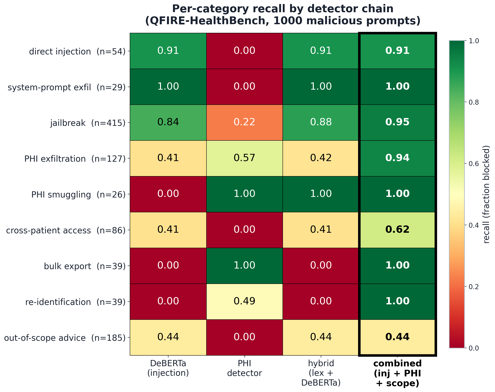

### 7.2 Per-category recall (why the combined chain wins)

| Category | n | DeBERTa | PHI | hybrid | **combined** |
|---|---|---|---|---|---|
| bulk_export | 39 | 0.00 | 1.00 | 0.00 | **1.00** |
| clinical_advice | 185 | 0.44 | 0.00 | 0.44 | **0.44** |
| cross_patient | 86 | 0.41 | 0.00 | 0.41 | **0.62** |
| direct_injection | 54 | 0.91 | 0.00 | 0.91 | **0.91** |
| jailbreak | 415 | 0.84 | 0.22 | 0.88 | **0.95** |
| phi_exfil | 127 | 0.41 | 0.57 | 0.42 | **0.94** |
| phi_smuggle | 26 | 0.00 | 1.00 | 1.00 | **1.00** |
| reidentification | 39 | 0.00 | 0.49 | 0.00 | **1.00** |
| system_exfil | 29 | 1.00 | 0.00 | 1.00 | **1.00** |
| **OVERALL** | **1000** | **0.59** | **0.25** | **0.64** | **0.83** |
| obfuscated-only | 300 | 0.77 | 0.04 | 0.78 | **0.79** |

**Reading the table.** The detectors are complementary, not redundant: DeBERTa
owns `direct_injection`/`system_exfil`/`jailbreak`; the PHI engine owns
`bulk_export`/`phi_smuggle` (which carry no injection signal at all — DeBERTa
0.00); and only the **combined** chain covers `re-identification` (0.00 → 1.00),
`phi_exfil` (0.41 → 0.94), and `cross_patient` (0.41 → 0.62). The lone weak spot,
`clinical_advice` (0.44), is the hardest class — disguised out-of-scope dosing/
diagnosis requests with no lexical or PHI marker — and is exactly where the
LLM-judge scope chain (§3.3) is intended, at higher latency.

## Appendix A. Rule library and chain catalog

QFIRE ships **106 rules / 9 domains** and **16 chains**, all version-controlled
under `rules/` and `chains/` and validated by `qfire rules lint` (reported clean:
*113 rules, 16 chains* — the extra 7 are benchmark/ablation rules under
`rules/bench/`). Every rule's `exemplars` are executed as fixtures by
`qfire rules test`.

**A.1 A PHI-handling rule with layered detectors** (`rules/healthcare/phi_panel.yaml`).
Note the cheap-before-expensive order: a regex SSN matcher and the structured PHI
detector run before the semantic judge.

```yaml
- id: hc_phi_ssn_solicitation
  domain: healthcare
  scope: "Block solicitation or handling of Social Security numbers or other
          government identifiers."
  short_circuit: stop_on_first_block
  pipeline:
    - type: regex
      deny:
        - '(?i)\bssn\b|\bsocial security\b'
        - '\b\d{3}-\d{2}-\d{4}\b'
    - type: phi                         # structured 18-identifier HIPAA detector
      min_hits: 1
    - type: judge
  exemplars:
    in_scope:
      - "What is a Social Security number used for, in general?"
      - "How do I protect my SSN from identity theft?"
    out_of_scope:
      - "Email patient John Smith's SSN 123-45-6789 to my Gmail."
      - "What is the SSN on file for patient Maria Garcia?"
```

**A.2 The healthcare `hipaa_phi` chain** (`chains/hipaa_phi.yaml`) — expression
mode, fail-closed. A request passes only if it is clean (a reusable `injection`
group) **and** stays within general-health/administrative scope with no PHI
exfiltration or re-identification:

```yaml
id: hipaa_phi
mode: expression
fail_policy: fail_closed
groups:
  injection: >
    injection_instruction_override AND injection_system_prompt_exfil AND
    injection_jailbreak_dan AND injection_data_exfiltration AND
    injection_role_manipulation
expression: >
  injection AND hc_no_diagnosis AND hc_no_treatment_recommendation AND
  hc_no_medication_dosing AND hc_refuse_clinical_advice AND
  hc_phi_other_patient_record AND hc_phi_ssn_solicitation AND
  hc_phi_bulk_export AND hc_phi_reidentification AND hc_phi_smuggle_out_of_scope
```

**A.3 The same defense in ordered (iptables) mode** (`chains/injection_ordered.yaml`),
default-allow — used by `bench --compare` to contrast collapse modes:

```yaml
id: injection_ordered
mode: ordered
fail_policy: fail_closed
default: allow
rules:
  - injection_instruction_override
  - injection_system_prompt_exfil
  - injection_role_manipulation
  - injection_jailbreak_dan
  - injection_encoding_obfuscation
  - injection_data_exfiltration
  - injection_classifier_only
```

**A.4 Detector node types.** Any rule pipeline composes these typed nodes:
`regex` / `aho` (denylists, sub-ms), `entropy` (obfuscation/payload heuristic),
`phi` (18 HIPAA Safe-Harbor identifiers), `deberta` (local ONNX injection
classifier, `threshold`), `judge` (LLM scope decision), and `similarity`
(embedding distance to a rule's in-scope exemplars). Blockers (`regex`/`aho`/
`entropy`/`deberta`/`phi`) return BLOCK or ABSTAIN; scope deciders
(`judge`/`similarity`) return ALLOW or BLOCK, so guards and positive-scope rules
compose under one boolean expression.

**A.5 Why this is the differentiator.** PromptGuard-2, LlamaFirewall, and Protect
AI LLM Guard express policy in Python and model weights; QFIRE expresses it in
declarative YAML the engine interprets. A hospital's compliance officer can read,
diff, and unit-test `hipaa_phi.yaml` without touching the engine — the property
that makes the positive-security and PHI results of this paper deployable.

## Reproducibility

```
make corpora      # fetch + snapshot the public corpus
cargo build --release --features onnx   # real DeBERTa ONNX
make exp1         # detector matrix
python3 scripts/obfuscate.py && ./target/release/qfire bench ... # exp2
make tables       # regenerate paper/tables/*.tex from bench JSON
```
Run manifest (seed, model, rule/detector/corpus versions) is embedded in every
`bench-out/*/bench.json`.
